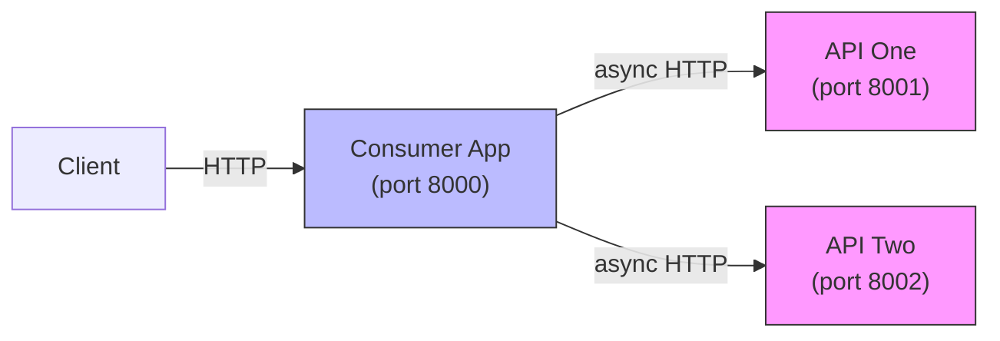

# async-flow (microservices demo)

This workspace contains a minimal demo of two simple FastAPI services and a separate FastAPI "consumer" app that calls them asynchronously.



Services:
- `api_one` (http://localhost:8001) — /items, /health
- `api_two` (http://localhost:8002) — /users, /health
- `consumer` (http://localhost:8000) — /aggregate (calls the two services concurrently)

Run with Docker Compose:

```bash
docker-compose up --build
```

Run locally (developer):
- Open three terminals and for each service run:
  - `cd services/api_one` && `pip install -r requirements.txt` && `python -m uvicorn app.main:app --reload --port 8001`
  - `cd services/api_two` && `pip install -r requirements.txt` && `python -m uvicorn app.main:app --reload --port 8002`
  - `cd services/consumer` && `pip install -r requirements.txt` && `python -m uvicorn app.main:app --reload --port 8000`

Example:
- GET `http://localhost:8000/aggregate` -> returns combined JSON of items and users.
